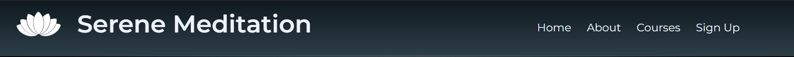

# Serene Meditation
Serene is a website designed for those looking for access to courses and memberships in meditation, yoga and wellness. People can find out on our website the styles of yoga we provide and the different types of methods to approach meditation.

Visit [live website here](https://mickkav.github.io/MeditationWebsite/index.html)

## About This Project
This project was intended to make easy access to well informed and educative courses on both Meditation and Yoga within the Dublin area.

### Built with
This project was structured and styled with HTML5 & CSS3.

## Features

- Navigation
    - Positioned at the top of the page and has name and logo of site which are both linked back to the home page.
    - The nav links are situated on the right hand side: Home, About, Courses and Sign up which all link to their respective pages on the site.
    - The nav links also have a hover animation feature used with a background color transition.
    - The navigation is accessible and very clear as to who we are and what we do from the get go.
    - Hamburger menu is used for smaller mobile devices

- The Header
    - The header has a hero image in its background of a buddhist shrine, it's colours being the spine of the layout for the rest of the site.
    - The cover text over the hero image reinforces who we are, what we do and where we do it in a minimal fashion.

    

- Our Mission
    - The mission section lays out the goals we aim to achieve when clients avail of the courses. We execute this with 3 cards with images resembling river rocks and text.
    - Seperated by linear gradient dividers to take the edge off the section

    

- The About section
    - The layout of the about section was used using the grid display which was learned on the app Mimo. A series of images creating an environment which we would like to portray to the customer.
    - The About us section gives a very brief and non stressing description on our capacities, laid out the horizon over water aimed to relax and soothe.

    

- Courses section
    - In the Courses section we have a title centered above two cards describing what both the yoga and meditation course offer.
    - The background of the card was a texture image of wood to provide a natural element to the page while staying within the color range.
    - Each card depicts the different styles of meditation & yoga on offer if any of the customers had preference.

    
- Sign up section
    - The Sign Up page has a form that collects details from the customer so they can join up to one or both of the courses they've chosen.
    - The information allows us to contact the customer from our database via email about joining and other offers that are available.
    - In the background the image is another image within the color palette range as to keep to continuity of the site.

    
- Footer
    - The footer has a header with a logo beside it that is linked back to the homepage.
    - Below their is a motivational message followed by an animated sign up button to speed up the sign up process by jumping them straigh to sign up in case they dont want to go through the sites information first.
    - Beneath the button are the social media links that go directly to their respected pages in new tabs so they dont leave the meditation site.
    - At the bottom of the footer is a makeshift copyright note of the website.

    

## Testing

- Testesd the page using Chrome, FireFox & Explorer.
- Tested for responsiveness via mobile phone and dev tools.
- Confirmation that the nav bar, header, about us, courses and sign up are all readable and easy to use.
- Tested that the form works and requires entries in all fields. Email only accept in email field.

### Bugs
- When first creating the home page there was an issue with the CSS and the 'our mission' section. The layout was not falling into place but was then quickly fixed with flexbox and some minor adjustments.
- When working on the footer I was having an issue with the fontawesome icons. They were not displaying. After a bit of research I inserted the missing 'script' tag and link required for it to function.
- When working About page issues were had with flexbox and reverted back to lesson learned on Mimo app about Grid and took reference from kevin powell youtube video on css grid to achieve this.
- An issue arose with the sign up button on the footer which i fixed with the on_click attribute via scaler.com

### Unfixed Bugs
- No unfixed bugs

## Validator testing

- HTML
    - No errors were returned when ran through W3C validator.

- CSS
    - No errors were returned when ran through the officail (Jigsaw) validator.

- Accessibility
    - I confirmed that colors and fonts that were used were legible and accessible by running through the lighthouse validatorin chrome dev tools.
    
    

## Deployment

- The site was deployed to GitHub pages. The steps to deploy are:
    - In GitHub repository go to settings
    - From the source section drop-down menu select Main branch
    - Once Main Branch is selected, the page provided the link to the completed website.
    Visit [live website here](https://mickkav.github.io/MeditationWebsite/index.html)

## Acknowledgements

 - Hover feature on navbar was done with tutorial video on youtube by Easy Tutorials [link is here](https://www.youtube.com/watch?v=oYRda7UtuhA&t=1597s&ab_channel=EasyTutorials)
 - Sign up form and home page cover text section were greatly inspired by the love running project template on the Code Institute full stack web development course.
 - Stack overflow, W3C, [CSS Tricks](https://css-tricks.com/snippets/css/a-guide-to-flexbox/#aa-flexbox-properties) & freecodecamp were used to source any issues I had with styling or layouts.
 - Information about meditation techniques was inspired by sections written on [chopra.com](https://chopra.com/articles/4-advanced-meditation-techniques-and-tools-to-deepen-your-practice)
 - Information about yoga techniques was inspired by sections written on [oneflowyoga.com](https://oneflowyoga.com/blog/what-is-vinyasa-yoga)
 - About us section was built using grid layout which was learned on [Mimo](https://dev.getmimo.com/)
 - Images were taken from open source sites such as [Pexels](https://www.pexels.com/) & [Unsplash](https://unsplash.com/)
 - Color palette was selected on [Coolers](https://coolors.co/)
 - Hamburger menu was guided by [Campsite Coders](https://www.youtube.com/watch?v=LciQi9PMnFY&ab_channel=CampsiteCoders) on youtube.

 ## Color Reference

| Color             | Hex                                                                |
| ----------------- | ------------------------------------------------------------------ |
| Example Color |  #dbb890 |
| Example Color |  #626866 |
| Example Color |  #2d3e48 |
| Example Color |  #0f181f |
| Example Color |  #edf2fb